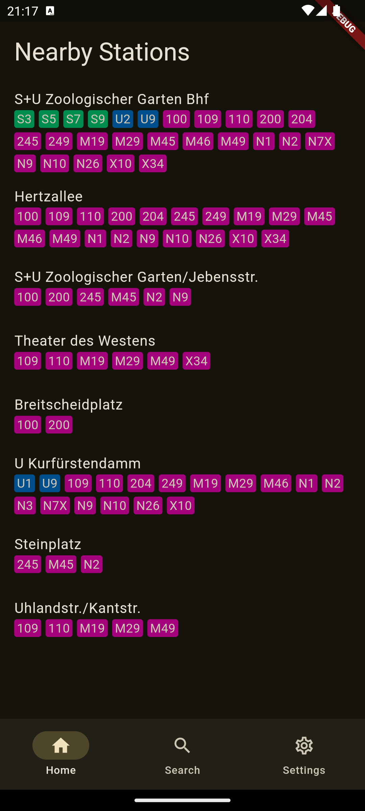
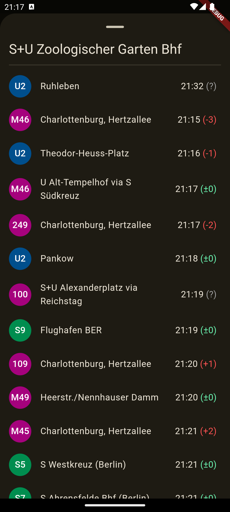

# Departures

A simple app that displays the departures of the public transport lines in Berlin.

<table>
    <tr>
        <td><b>Home Page</b></td>
        <td><b>Departure List</b></td>
    </tr>
    <tr>
        <td></td>
        <td></td>
    </tr>
</table>

## Installation

### Using [Obtainium](https://github.com/ImranR98/Obtainium) (Recommended)
It is recommended you use Obtainium to install this app, as it will ensure you download the correct file and will automatically update the app for you. To install Departures using Obtainium, simple paste the link of this repository (https://github.com/drenkmann/departures) into Obtainium.

### Manually
To install manually, download the `app-release.apk` and install it.

## Credit
The underlying API, developed by [@derhuerst](https://github.com/derhuerst) can be found here: https://v6.bvg.transport.rest/

## License
This project is licensed under the [MIT license](./LICENSE.md)
